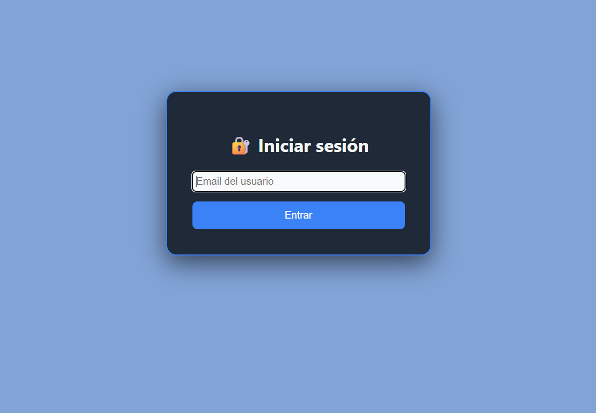
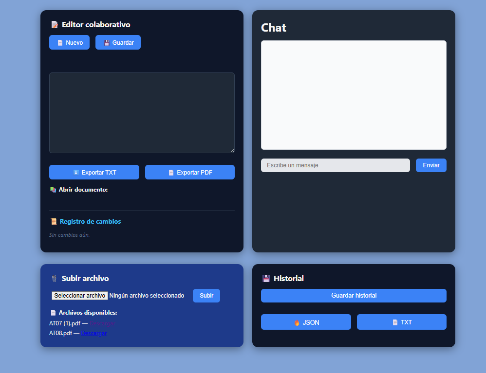

# App Chat

Aplicación web que permite envio de mensajes, envio y descarga de ficheros .pdf y .txt y modificacíon de documentos con otras personas en tiempo real

## Enlaces

- [React](https://es.react.dev/)
- [express-fileupload](https://www.npmjs.com/package/express-fileupload)

## Login



## Vista previa



## Instalación

### Prerequisitos

- Editor de código compatible (VSC)
- [`git`](https://git-scm.com/)
- [NodeJS](https://nodejs.org/en)


### Instalación

1. Instalar dependecias de servidor y react
```bash
npm install
```   

2. Abrir puerto al servidor con NodeJS

```bash
node .\server\index.js
```

3. Ejecutar el entorno de React + vite
```bash
npm run dev
```

## Como funciona

# Rutas importantes

```
/client/src/App.tsx          → Componente principal de cliente, devuelve la vista (frontend)
/server/index.js          → Servidor con endpoint para realizar peticiones de forma asíncrona con el frontend (backend)
/client/src/components        → Carpeta donde se encuentra diferentes partes de la aplicación al igual que funciones de la web
/server/archivos    → Carpeta que contiene los archvivos subidos, solo admite .pdf y .txt de 2MB como máximo
/server/data/data.json       → Archivo que contiene la información de los usuarios
/server/data/historial.json       → Archivo que guarda cuando y quien escribió un mensaje 
/server/documents       → Carpeta que contiene los documentos escritos por los usuarios
/server/exports       → Carpeta que contiene el resultado de final de los documentos escritos por los usuarios
```

# Diseño y estilos

Para el diseño de la vista se ha utilizado en su totalidad CSS